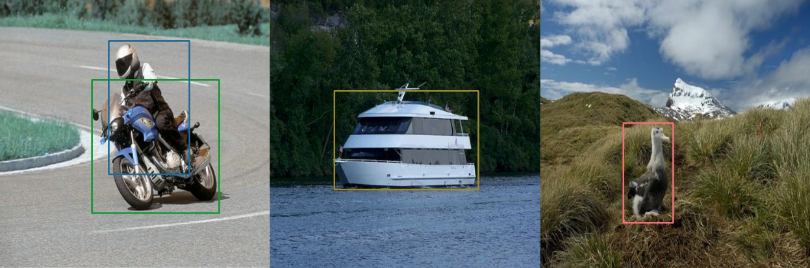

    

-----------------

Modified **TensorFlow 2.4+** (or 2.2 if you use XCenterNet tagged as v1.0.0) tf.keras implementation of **CenterNet** object detection as described in [Objects as Points](https://arxiv.org/abs/1904.07850)
by Xingyi Zhou, Dequan Wang, Philipp Krähenbühl and **TTFNet** as described in [Training-Time-Friendly Network for Real-Time Object Detection](https://arxiv.org/pdf/1909.00700.pdf) by Liu Tu Zheng, Guodong Xu, Zheng Yang, Haifeng Liu, Deng Cai. For original implementation please see [Centernet pytorch repository](https://github.com/xingyizhou/CenterNet) and [TTFNet pytorch repository](https://github.com/ZJULearning/ttfnet).

    

This implementation is not exact copy of the papers or pytorch implementations as we modified it for our needs, some of the features of this repo:

* Using tf2.2+ keras model train_step with tf.data.dataset
* Using tensorflow.keras.applications.efficientnet from tf2.3+
* Efficientnet and Resnet backbones
* Multi-scale training and augmentations for tf.dataset
* Added *stronger* NMS for better results
* No pose estimation or 3D, just simple object detection
* Using deformable convolutions
* Easy to finetune on your own dataset and customize your own image augmentation, feature extraction heads, backbones ...

We were inspired (and some part of the source codes were taken) by (from) other open-source repositories ([tf-retinanet](https://github.com/fizyr/tf-retinanet), [keras-CenterNet](https://github.com/xuannianz/keras-CenterNet), ...), please see *License* section down on this project page. Without them this will be not possible, **BIG THANKS to them**.

We loved the idea of fast and simple anchor-free object detection model. We spent a lot of time, money and gpu resources (yes we accept donation of RTX cards :D) developing this project. If you would like to support our work follow us on [Twitter](https://twitter.com/ximilar_com), [LinkedIn](https://www.linkedin.com/company/ximilar), [FB](https://www.facebook.com/Ximilar) or [Instagram](https://www.instagram.com/ximilar_ai/). Thank you for any support! We welcome any help with pretraing models and with further improvements.

### Todos

* Add Instance or Semantic segmentation heads if it is possible ([link1](https://github.com/CaoWGG/CenterNet-CondInst), [link2](https://arxiv.org/pdf/2003.05664.pdf))
* Train and publish more models and backbones on mscoco

### Deformable Convolutions
You can read more about this improvement of standard convolutional layers for example in a [following paper](https://arxiv.org/abs/1703.06211)
We found out that it works very well on our models. 

Unfortunately there is no official implementation.
We are using implementation from [smallsunsun1](https://github.com/smallsunsun1). Currently, you
can find it in his [fork](https://github.com/smallsunsun1/addons/tree/feature/deformable_ops) of TensorFlow Addons for tf2.2 or
[here](https://github.com/Cospel/addons/tree/feature/deformable_ops) if you want tf2.4 version.
There is an active [merge request](https://github.com/tensorflow/addons/pull/1129) to the Addons, we hope it will get there soon.

## Pretrained Models

| Backbone       | Type         | Mode         | mAP         |  Dataset     | Download | TensorBoard | Resolution |
|----------------|--------------|--------------|-------------|--------------|----------|-------------|------------|
| ResNet 18      | CenterNet    | DCNSHORTCUT*  | 0.7         | Pascal VOC   |   [Link](https://drive.google.com/drive/folders/1eCNCb1H4rqT_-EqSk5zfIldUzct2dcG-?usp=sharing)   |    [Link](https://tensorboard.dev/experiment/lCAX1e66S224Ds5pT63WDg/)     |     384     |
| ResNet 18      | CenterNet    | CONCAT       | 0.64        | Pascal VOC   |   [Link](https://drive.google.com/drive/folders/1Do-TRHDmY6nkYVMXo5Yd4jBKnUK0eaJJ?usp=sharing)   |    [Link](https://tensorboard.dev/experiment/IWfKJYspQVaYHJWCwQZiVA/)     |     512     |
| ResNet 18      | TTF / DIOU   | DCNSHORTCUT*  | 0.7         | Pascal VOC   |   [Link](https://drive.google.com/drive/folders/1HmgZbVbq9C00Lkzqqyu76Cq5AmAR940L?usp=sharing)   |    [Link](https://tensorboard.dev/experiment/vkHkd0CORAW9BFBw9Noa4A/)     |     512     |
| ResNet 18      | TTF / DIOU   | DCNSHORTCUT*  | 0.28        | MSCOCO17     |   [Link](https://drive.google.com/drive/folders/1x0iskz7hB6wN4XIRxrpTVnXVdIf83YNU?usp=sharing)   |    [Link](https://tensorboard.dev/experiment/ip5amy6NQ6SMD5GJL3wMKQ/)     |     384     |

\* Model is using deformable convolutions, you need to install TensorFlow Addons with deformable convolutions, see the paragraph above for more info.

The mAP results in table are for IoU > 0.5 and score threshold > 0.01. For MSCOCO the mAP is for IoU=0.50:0.95 area=all. We still experience bit overfitting on Pascal VOC and MSCOCO, probably better augmentation, bigger batch size, longer training time can improve the result by few percentage points. In order to train CenterNet you will need to train it in our experience for many epochs. You can see the training progress in provided tensorboards along with learning rate schedule. We use Pascal VOC 2007+2012 TRAIN and VALIDATION dataset for training and we evaluate on Pascal VOC 2007 TEST. For MSCOCO we use 2017 TRAIN vs VALIDATION. Note that all tensorboard logs shows mAP for score threshold > 0.3 and IoU > 0.5.

***We hope the tensorboards will give you more insights for reproducing and improving future results.***

## Installation

1) Clone this repository.
2) Install tensorflow 2.4+
3) Clone and Install [tf-image](https://github.com/Ximilar-com/tf-image)
4) Install [tf-addons](https://www.tensorflow.org/addons). If you want to use models with deformable convolution (DCN) you will need to install tf.addons from [this branch](https://github.com/smallsunsun1/addons/tree/feature/deformable_ops) for tf2.2 or [updated fork](https://github.com/Cospel/addons/tree/feature/deformable_ops) for tf2.4. 
5) In the repository, execute `pip install . --user`.
6) Alternatively, you can run the code directly from the cloned repository, however you need to run `python setup.py build_ext --inplace` to compile Cython code first.
7) Install [classification_models](https://github.com/qubvel/classification_models), tfds and requirements.txt ...

## Train

For training on PASCAL VOC dataset run in `scripts` folder:

    CUDA_VISIBLE_DEVICES=0 nohup python train.py --model_type centernet --model_mode simple --log_dir results_voc

For training on MSCOCO:

    CUDA_VISIBLE_DEVICES=0 nohup python train.py --dataset coco --model_type centernet --model_mode simple --log_dir results_coco

##### Train/Finetune on your dataset

You will need to use `--dataset custom` arg  with `--dataset_path_tr train.json` when running a training. The `train.json` should be in [mscoco format](https://www.immersivelimit.com/tutorials/create-coco-annotations-from-scratch). You can start with downloaded pretrained model:

    CUDA_VISIBLE_DEVICES=0 python train.py --dataset custom --dataset_path_tr train.json --dataset_path_te test.json  --batch_size 20 --pretrained_weights ~/centernet_results/dcn/model.h5 --model_type centernet --model_mode dcnshortcut --image_size 512

The format of bounding box in mscoco is [xmin, ymin, width, height] which is converted in our code to the [ymin, xmin, ymax, xmax] (our format) inside of [`custom_dataset.py`](xcenternet/datasets/custom_dataset.py) data loader. For example you can try to generate mscoco format with images for mnist detection through [`scripts/helpers/make_mnist.py`](scripts/helpers/make_mnist_coco.py). Every dataset is internally working with relative [0-1] coordinates and during the training are converted to absolute setReadOnlyAugmentations.

To change learning rate behaviour rewrite method scheduler in dataset class.

##### Multi-GPU training

If you would like to train your model on multiple gpus, simply specify env variable CUDA_VISIBLE_DEVICES=0,1,2,... when running [`train.py`](scripts/train.py). The model is mirrored on the gpus, you should also increase the batch_size according to number of gpus.

## Modifications

##### Backbones

You can play with/implement your custom feature extractors or custom backbones. See [`model_factory.py`](xcenternet/model/model_factory.py) and backbone folder. You can implement also your own feature extraction head. To get more information how to do this look into [`layers.py`](xcenternet/model/layers.py) and [`upsample.py`](`xcenternet/model/backbone/upsample.py`). You will need to update also [`config.py`](xcenternet/model/config.py).

##### Augmentation

The main image/bbox augmentation work is done in [`batch_preprocessing.py`](xcenternet/model/preprocessing/batch_preprocessing.py). You can add (or remove) more augmentations suitable for your data. For example flip upside down is turned off by default. Because we are using `tf.data.Dataset` you will need to use tf.py_function or implement your augmentations in tf graph. Most of the augmentation is done through [tf-image tools.py](https://github.com/Ximilar-com/tf-image/blob/master/tf_image/application/tools.py).

You can turn off/on some default augmentations through [`augmentations.py`](xcenternet/model/preprocessing/augmentations.py) (flip upside-down, ...).

## Test

##### Evaluation

You can evaluate your model with different thresholds, go to the `scripts` folder and run `eval.py` script:

    CUDA_VISIBLE_DEVICES=0 python eval.py --model_type centernet --model_mode concat --load_model ../train/results_voc/checkpoints/model_95 --threshold 0.01 --iou_threshold 0.49 --dataset voc

If you need to evaluate on mscoco dataset then you will need to download the annotation files from [coco page](http://cocodataset.org/#download).

Eval on your custom dataset:

    CUDA_VISIBLE_DEVICES=3 python ../scripts/eval.py --load_weights vocsave/checkpoints/model_10 --image_size 512 --threshold 0.3 --model_mode dcnshortcut --model_type centernet --dataset custom --dataset_path test.json

##### Show result on one image

Go to the `scripts` folder and run `predict.py`, the result is stored in result.jpg file:

    CUDA_VISIBLE_DEVICES=0 python predict.py --load_model ../scripts/results_voc/checkpoints/model_111 --backbone resnet18 --model_mode concat --image_path voc/21.jpg

## About us

We are a machine learning studio building the best & easy-to-use platform focused on computer vision, image recognition, detection and search. We are also developing custom solutions for healthcare, industry40, ecommerce, [**fashion**](https://demo.ximilar.com/fashion)), real estate, .... We used xCenterNet project in some of our own solutions. It is possible to train your own xCenterNet models through the [**Ximilar**](https://ximilar.com) ***platform without single line of code***. 🇨🇿🇪🇺

## License

This project is released under the MIT License. Please take other licenses into consideration too when use this project. For example evaluation scripts were taken and then modified from [tf-retinanet](https://github.com/fizyr/tf-retinanet) which is based on Apache License. Heatmap generations, map computation, some augmentations, upsampling head features were taken and modified for our needs from [TF_CenterNet_](https://github.com/MioChiu/TF_CenterNet_), [keras-CenterNet](https://github.com/xuannianz/keras-CenterNet) and original [Pytorch repository](https://github.com/xingyizhou/CenterNet).
